## Markov Decision Processes
主要参考了david silver 的ppt..
#### 1.马尔可夫性质

一个随机过程，在给定当前状态以及所有过去状态的情况下，未来状态的条件概率分布只依赖于当前状态。也就是说，时间$t+1$的的环境响应只取决于时间$t$的状态和行为。即使环境没有完全符合马尔可夫性，我们也将其近似成马尔可夫。

#### 2.马尔可夫链

具有马尔可夫性质的过程被称为马尔科夫过程，其中最有名的就是马尔可夫链。马尔可夫链是一个概率向量序列$x_0,x_1,x_2,...$ 和一个随机矩阵$P$,使得$x_1=Px_0, x_2=Px_1, x_3=Px_2 ,...$,用一阶差分方程表示就是：

$x_{k+1}=Px_k, k=0,1,2,...$ 下面是David强化学习教程PPT中的一个例子：

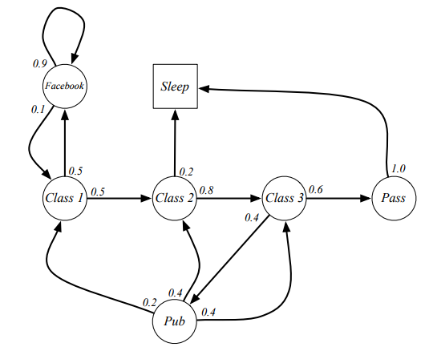

学生从课程一开始可能的状态序列构成的马尔科夫链可能是：

-  C1, C2, C3, Pass, Sleep
-  C1, FB, FB, C1, C2, Sleep
-  C1, C2, C3, Pub, C2, C3, Pass, Sleep
-  C1, FB, FB, C1, C2, C3, Pub, C1, FB, FB
-  FB, C1, C2, C3, Pub, C2, Sleep

表示成矩阵的形式就是：

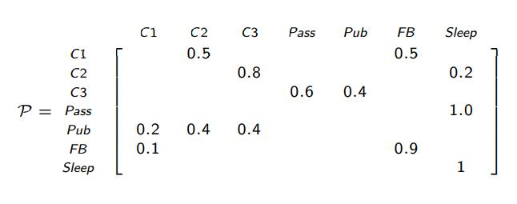

#### 3.马尔可夫奖励过程（Markov Reward Process）

马尔科夫奖励过程是一个带奖励值的马尔科夫链，还是拿上面的学生图来举例：

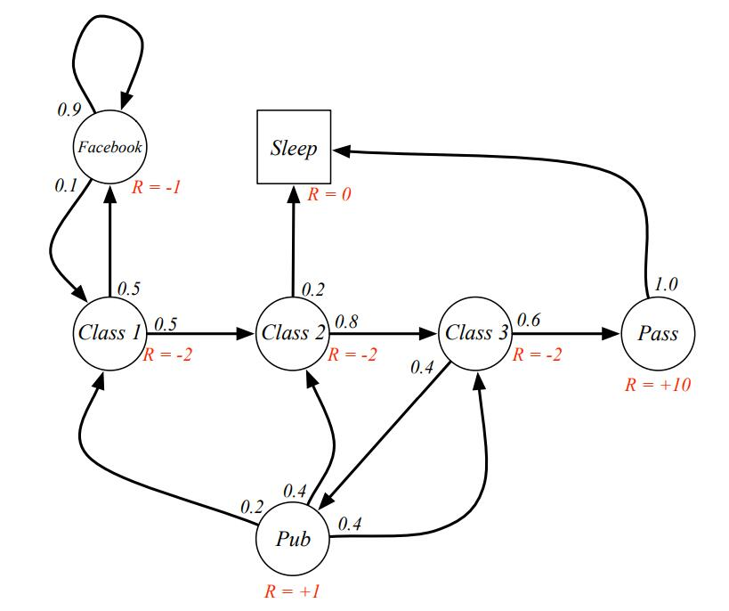

一个MRP是一个tuple$(S,P, R, \gamma)$:

- $S$ 是一个有限的状态集合
- $P$ 是一个状态转移概率矩阵
- $R$ 是一个回报函数，$R_s=E[R_{t+1}|S_t=s]$
- $\gamma $ 是一个折扣因子，$\gamma \in [0,1]$

我们定义$G_t$是从第t个时间步的总折扣奖励：(这里理解的时候需要注意一点，因为马尔可夫过程是随机的，因此$G_t$ 也是随机的)
$$
G_t = R_{t+1} + \gamma R_{t+2}+...=\sum^ \infty _{k=0} \gamma^kR_{t+k-1}
$$
其中$\gamma \in [0,1]$,是未来奖励的折扣因子，即未来奖励的权重会越来越小。

在k+1个时间步后获得的奖励R的值是$\gamma R$。

当$\gamma$接近于$0$时，这是一个“近视”的估值，当$\gamma$ 接近于$1$ 时，这会是一个“有远见”的估值。

那么为什么要添加这个折扣因子$\gamma$呢，有很多种解释，其实本质上就是因为这样处理比较方便而且有效。

- 在数学上方便折扣奖励
- 在循环马尔可夫过程中避免无限回报
- 未来是不确定性的，也许并不能得到充分兑现
- 如果奖励是金融的，立即奖励可能会比延迟奖励赚更多利息
- 动物或者说人类的行为表现他们偏好于立即奖励
- 有时候可以使用未折扣的马尔可夫奖励过程($\gamma = 1$)

#### 4.MRP的价值函数（Value Function for MRP）

MRP的状态价值函数（state value function）$v(s)$是从状态s开始的预期回报：
$$
v(s)=E[G_t|S_t=s]
$$
显然，$v(s)$就是$G_t$的期望值。

然后根据**贝尔曼方程**，我们可以得到一个递推公式：

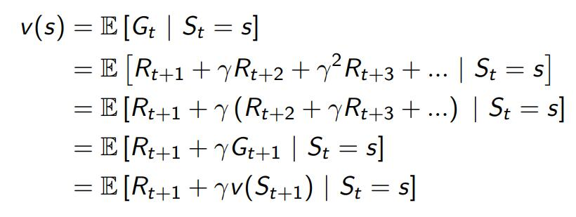

即价值函数通过当前的立即奖励$R_{t+1}$,加上后继者的价值函数值$v(S_{t+1})$乘以折扣系数$\gamma$得到。也就是说，要计算当前的状态价值函数值，只需要知道当前的奖励和后继状态的价值函数值即可，以此往前推，类似于递归。

Bellman方程可以用矩阵的形式简洁地表示：$v=R+\gamma Pv$

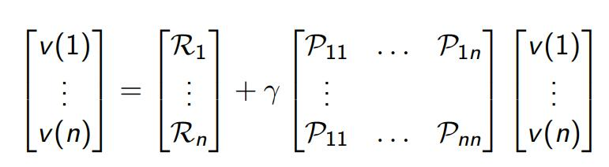

定义看起来会比较抽象，下面我举一个具体的例子来说明，比如上面的马尔科夫回报过程，我们计算出每个状态的价值函数值，为了方便计算，我们选择 $\gamma =1$, 计算过程如下图所示：

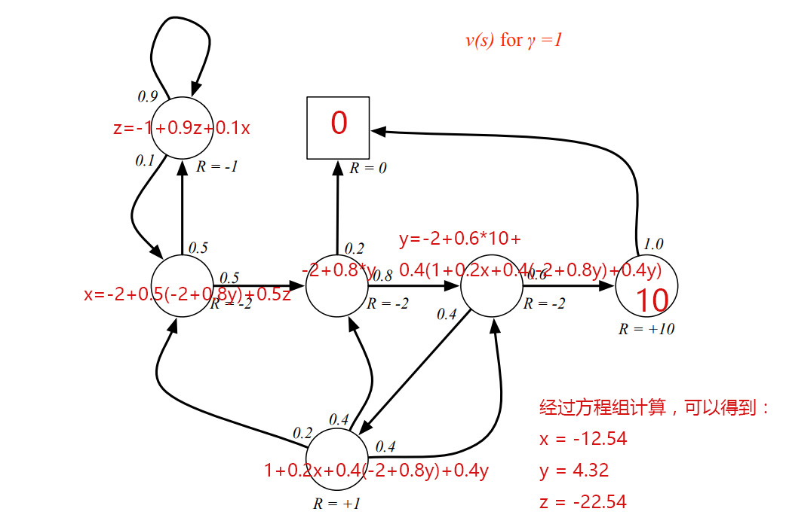

#### 5.马尔可夫决策过程(Markov Decision Process)

一个马尔可夫决策过程是一个带决策的马尔可夫回报过程。它是一个所有状态都具有马尔可夫性质的环境。它的定义如下：

一个马尔可夫决策过程是一个tuple$(S, A,P,R,\gamma)$

- $S$ 是一个有限的状态（states）集合

- $A$ 是一个有限的行动（actions）集合

- $P$ 是一个状态转移概率矩阵，

  $P^a_{ss'}=P[S_{t+1}=s'|S_t=s,A_t=a]$

- $R$ 是一个回报函数，$R^a_s=E[R_{t+1}|S_t=s,A_t=a]$

- $\gamma$ 是一个折扣因子，$\gamma \in [0,1]$

还是用之前的图来举例，在转移箭头上加上了行动（action）:

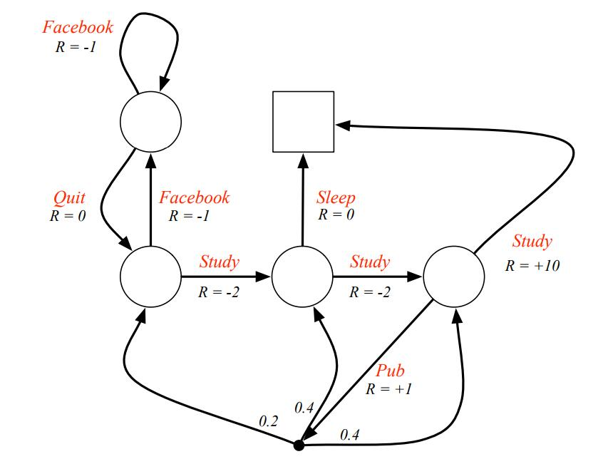

##### 5.1 策略(Policies)

一个策略$\pi$ 是对状态行动的一个分配：
$$
\pi(a|s)=P[A_t=a|S_t=s]
$$
策略具备以下特点：

- 策略完全定义了agent的行为
- MDP策略取决于当前状态（而不是历史状态）
- 策略是固定的（时间独立的），$A_t ~ \pi(·|S_t),  $

给定一个MDP $M = <S,A,P,R,\gamma>$ 和一个策略$\pi$, 状态序列$S_1, S_2,...$ 是一个马尔可夫过程$<S, P^\pi>$,状态和回报序列$S_1, R_2, S_2,...$ 是一个马尔可夫回报过程$<S, P^\pi,R^\pi, \gamma>$ :
$$
P^\pi _{s,s'}=\sum_{a\in A}\pi(a|s)P^a_ss'
$$

$$
R^\pi _s=\sum _{a \in A} \pi (a|s)R^a_s
$$

##### 5.2 MDP的价值函数（Value Function for MDP）

引入策略$\pi$ 之后，MDP的状态价值函数（state-value function）可以定义为是从状态$s$ 开始，然后遵循策略$\pi$ 的期望回报：
$$
v_\pi(s) = E_\pi [G_t|S_t=s]  	\tag{5.2.1}
$$
参照上面，行动价值函数（action-value function）$q_\pi(s,a)$ 是从状态$s$开始，遵循策略$\pi$,采取行动$a$ 的期望回报：
$$
q_\pi(s, a) = E_\pi[G_t|S_t=s, A_t=a] \tag{5.2.2}
$$
同样，根据Bellman方程，状态价值函数可以分解为立即回报加上后继者的折扣价值：
$$
v_\pi(s)=E_\pi[R_{t+1}+\gamma v_\pi(S_{t+1})|S_t=s] \tag{5.2.3}
$$
类似的，行动价值函数可以分解为：
$$
q_\pi(s,a)=E_\pi[R_{t+1}+\gamma q_\pi(S_{t+1}, A_{t+1})|S_t=s] \tag{5.2.4}
$$
根据上面的定义，我们可以知道状态价值函数$v_\pi(s)$ 就是从状态$s$ 开始，采用所有的行动的行动价值的加权和（权重就是采取对应行动的概率）：
$$
v_\pi(s) = \sum _{a \in A}\pi (a|s)q_\pi (s, a) \tag{5.2.5}
$$
而行动价值$q_\pi (s,a)$ 要怎么计算呢？根据式5.2.4，我们知道行动价值就是采取当前行动的直接回报$R_s^a$, 加上所有未来折扣状态价值的加权和（这个权重就是采取对应行动后的状态转移概率）：
$$
q_\pi(s,a) = R^a_s + \gamma \sum _{s' \in S}P^a_{ss'}v_\pi(s') \tag{5.2.6}
$$
将式5.2.5代入式5.2.6，可以得到终极形态的求解方式：
$$
q_\pi(s,a ) = R^a_s + \gamma \sum _{s' \in S}P^a_{ss'}\sum _{a' \in A}\pi (a'|s')q_\pi(s',a')
$$
如果觉得上面的公式还太抽象，那我们再拿上面的图举一个例子：

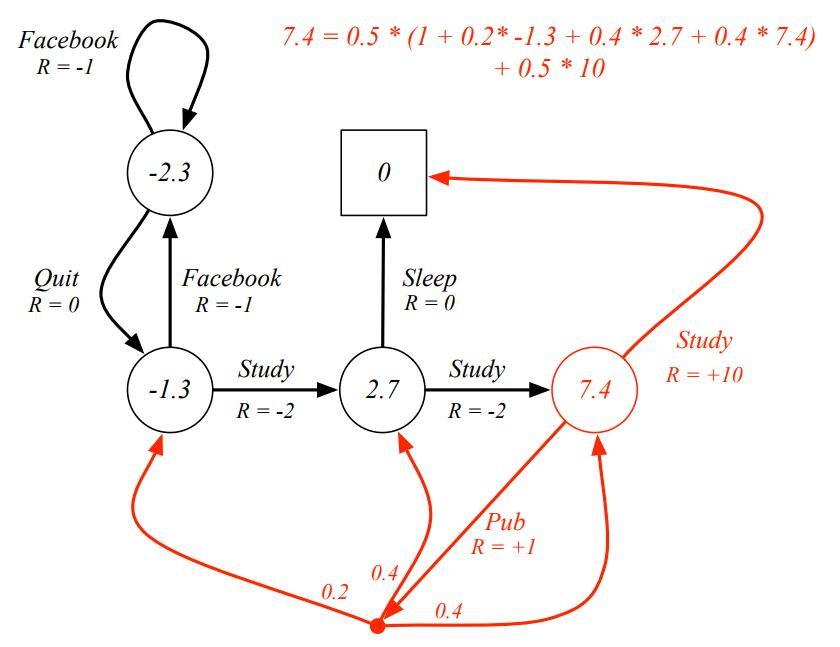

每个状态点的算法前面已经讲过了，就不重复说了，我们只举例说明一下红色圈这个状态$s$的计算方式。

$s$可以有两个行动选择， **Study**或者**Pub**，概率都是$0.5$ ，因此两者的权重都是$0.5$, 采取**Study**的行动价值函数是当前行动回报$10$加上后继状态回报0，而采取**Pub** 的行动价值函数是当前行动回报$1$加上后继状态回报$0.2*(-1.3)+0.4*2.7+0.4*7.4$, 于是可得$v_\pi(s)=0.5*(10+0)+ 0.5*(1+ 0.2*(-1.3)+0.4*2.7+0.4*7.4)=7.4 $

Bellman返程可以用引导MRP的方式简洁的表达：
$$
v_\pi = R^\pi + \gamma P^\pi v\pi = (1-rP^\pi)^{-1}R^\pi
$$

#### 6.最优价值函数(Optimal Value Function)

最优状态价值函数$v_*(s)$ 是所有策略的**最大**价值函数：
$$
v_*(s) = max_\pi v_\pi (s)
$$
最优行动价值函数$q_*(s, a)$ 是所有策略的**最大**行动价值函数：
$$
q_*(s,a) = max_\pi q_\pi (s, a)
$$
最佳价值函数指定MDP最佳的性能。当我知道最佳价值函数$fn$时，我们称这个MDP被解决了。

继续用上面的图来举例最佳指函数，为了方便计算，还是假定$\gamma = 1$ 。

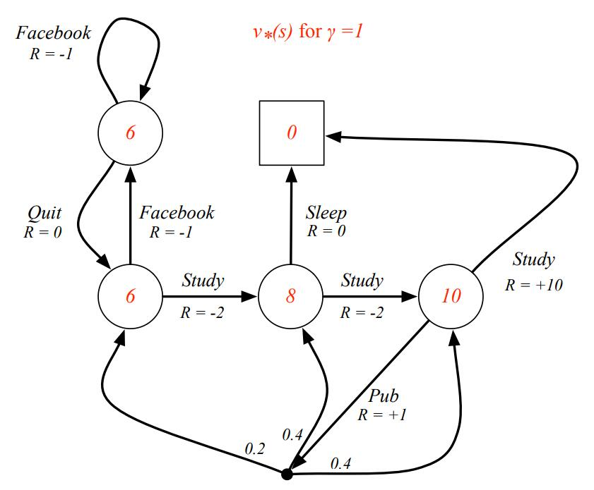

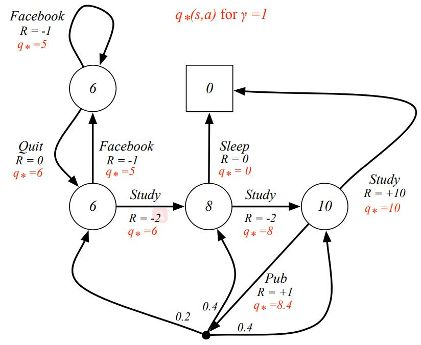

##### 6.1 最优策略(Optimal Policy)

定义一个策略的偏好排序，状态价值函数越大，策略越好：
$$
\pi >= \pi' if   v_\pi >=v_{\pi'}(s) , ∀s
$$
有以下定理，对于所有的马尔可夫决策过程有：

- 存在一个策略$\pi _*$, 比其他策略好或者相同， $\pi _* \geq \pi, ∀s$
- 所有的最优策略都实现了最优价值函数
- 所有的最优策略都实现了最优行动价值函数

也就是说，对于任意一个MDP总是有确定的最优策略，如果我们知道最优行动价值函数，我们立即就知道最优策略。

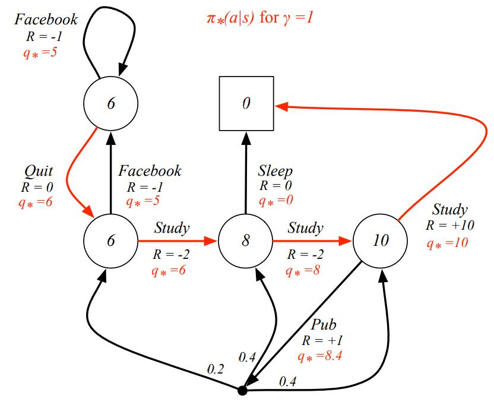

#### 7.部分可观测MDPs(Partially Observable MDPs)

部分可观测马尔可夫决策过程是隐藏状态的MDP。这是一个带有动作的隐马尔可夫模型。

一个POMDP是一个tuple $<S,A,O,P,R,Z, \gamma>$

- $S$ 是一个有限状态集合

- $A$ 是一个有限行动集合

- $O​$ 是一个有限的观察集合

- $P$ 是一个状态转移概率矩阵

  $P^a_{ss'} = P[S_{t+1}=s' |S_t=s, A_t=a]$

- $R$ 是一个回报函数

- $Z$ 是一个观察函数

  $Z^a_{s'o} = P[O_{t+1}=o | S_{t+1}=s', A_t=a]$

-  $\gamma $是折扣因子 $\gamma \in [0,1]$

一个history $H_t$ 是一系列**行动**、**观察**和**奖励**。
$$
H_t = A_0, O_1, R_1, ...,A_{t-1}, O_t, R_t
$$
信念状态（belief state）$b(h)$ 是一个以历史h为条件的状态概率分布：
$$
b(h) = (P[S_t=s^1 | H_t=h], ..., P[S_t=s^n|H_t=h])
$$
信念状态满足马尔可夫性质。

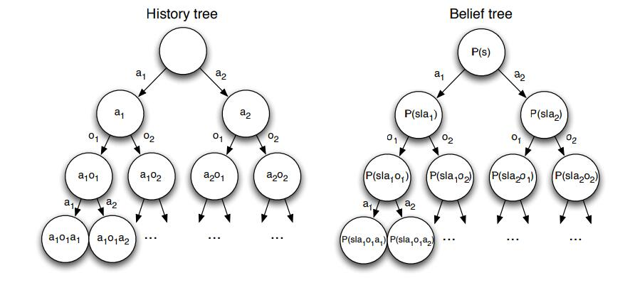

- 一个POMDP可以简化为一个（无限）历史树。
- 一个POMDP可以简化为一个（无限）信念树。

#### 8.MDP平均奖励

一个遍历马尔可夫过程是：

周期性：每个状态被访问无数次

非周期性：每个状态都被访问，没有任何系统时间

遍历马尔可夫过程具有极限平稳分布$\pi(s)$ 的性质：

.... 后面再继续